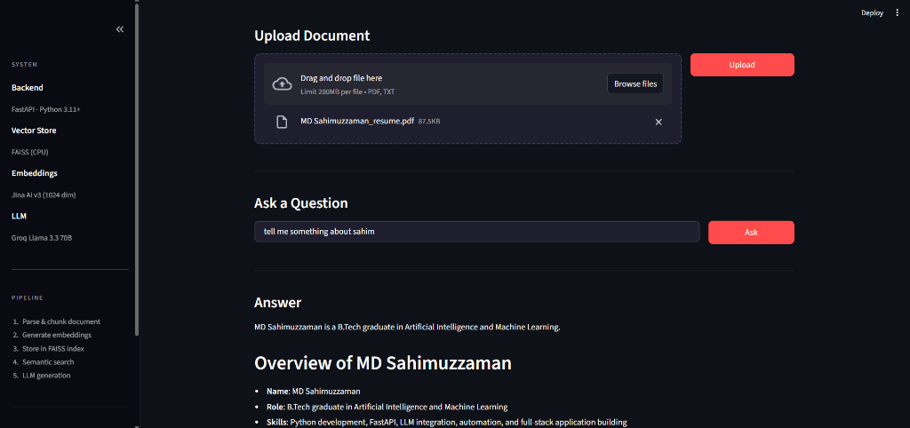

# RAG-Based Question Answering System

A retrieval-augmented generation (RAG) system that enables question answering grounded strictly in uploaded documents.



---

## 1. Project Overview

This system allows users to upload PDF or TXT documents and ask questions about their content. Answers are generated using an LLM but are **grounded only in the retrieved document context**, preventing hallucination.

**Problem Solved:** Traditional LLMs can hallucinate or provide outdated information. This RAG system ensures answers are factually grounded in user-provided documents.

---

## 2. Architecture

```
┌─────────────┐     ┌──────────────────────────────────────────┐
│   Client    │     │           FastAPI Backend                │
│  (UI/API)   │──▶  │                                          │
└─────────────┘     │  ┌────────────────────────────────────┐  │
                    │  │  POST /upload                      │  │
                    │  │  POST /query                       │  │
                    │  └──────────────┬─────────────────────┘  │
                    │                 │                        │
                    │  ┌──────────────▼─────────────────────┐  │
                    │  │  Background Ingestion              │  │
                    │  │  - PDF/TXT Parsing                 │  │
                    │  │  - Text Chunking (1000/200)        │  │
                    │  │  - Embedding Generation (Jina AI)  │  │
                    │  └──────────────┬─────────────────────┘  │
                    │                 │                        │
                    │  ┌──────────────▼─────────────────────┐  │
                    │  │  FAISS Vector Store                │  │
                    │  │  - Similarity Search (Top-5)       │  │
                    │  │  - Persistent Index on Disk        │  │
                    │  └──────────────┬─────────────────────┘  │
                    │                 │                        │
                    │  ┌──────────────▼─────────────────────┐  │
                    │  │  LLM Integration (Groq)            │  │
                    │  │  - Context Injection               │  │
                    │  │  - Answer Generation               │  │
                    │  └────────────────────────────────────┘  │
                    └──────────────────────────────────────────┘
```

**Key Features:**
- Background ingestion (non-blocking uploads)
- FAISS vector persistence (survives restarts)
- Structured answer formatting

---

## 3. Technical Decisions

### Chunk Size: 1000 characters, 200 overlap
- **Why:** Balances context completeness with retrieval precision. Smaller chunks lose context; larger chunks dilute relevance. Overlap ensures no information is lost at boundaries.

### Retrieval Failure Case Observed
- **Issue:** When a query uses terms not semantically similar to document content, FAISS returns low-relevance chunks.
- **Handling:** The LLM responds with "I don't know based on the provided documents" when context is insufficient.

### Metric Tracked: LLM Response Latency
- **Implementation:** Logged in `llm.py` with timestamps
- **Typical Range:** 550ms - 1400ms per query
- **Log Example:** `LLM Response generated in 551.17ms. Model: llama3-8b-8192`

---

## 4. Setup Instructions

### Prerequisites
- Python 3.10+
- API Keys: Jina AI (embeddings), Groq (LLM)

### Installation

```bash
# Clone and navigate
cd rag_app

# Create virtual environment
python -m venv venv
venv\Scripts\activate  # Windows
source venv/bin/activate  # Linux/Mac

# Install dependencies
pip install -r requirements.txt

# Configure environment
copy .env.example .env
# Edit .env with your API keys
```

### Environment Variables

| Variable | Description |
|----------|-------------|
| `JINA_API_KEY` | Jina AI API key for embeddings |
| `GROQ_API_KEY` | Groq API key for LLM |

### Running the System

```bash
# Terminal 1: Start API server
python -m uvicorn app.main:app --host 127.0.0.1 --port 8000

# Terminal 2: Start UI (optional)
streamlit run ui/app.py
```

**Access:**
- API Docs: http://127.0.0.1:8000/docs
- Streamlit UI: http://localhost:8501

---

## 5. Usage

### Upload Document

```bash
curl -X POST "http://127.0.0.1:8000/api/upload" \
  -F "file=@document.pdf"
```

**Response:**
```json
{"message": "File 'document.pdf' uploaded. Ingestion started."}
```

### Query Document

```bash
curl -X POST "http://127.0.0.1:8000/api/query" \
  -H "Content-Type: application/json" \
  -d '{"question": "What is the main topic?"}'
```

**Response:**
```json
{
  "answer": "The document discusses...",
  "sources": [
    {"source_file": "document.pdf", "chunk_id": "document.pdf_chunk_0"}
  ]
}
```

---

## 6. Testing

Only **end-to-end testing** is retained (`test_e2e.py`) as it validates the complete RAG pipeline:

```bash
python test_e2e.py
```

**Tests Covered:**
- Health check
- TXT/PDF upload
- Simple and summary queries
- Typo handling
- Sources validation

**Result:** 6/6 tests passed

---

## 7. Known Limitations

1. **No Authentication:** API is open; suitable for demo only
2. **Single-threaded FAISS:** Not optimized for high concurrency
3. **Context Window:** Large documents may exceed LLM context limits
4. **Summary Queries:** May return 0 sources when chunks are not semantically matched

---

## 8. Project Structure

```
rag_app/
├── app/
│   ├── api/routes.py       # API endpoints
│   ├── core/
│   │   ├── config.py       # Environment configuration
│   │   └── logging.py      # Logging setup
│   ├── services/
│   │   ├── chunking.py     # Text chunking
│   │   ├── embeddings.py   # Jina AI embeddings
│   │   ├── ingestion.py    # Document ingestion pipeline
│   │   ├── llm.py          # Groq LLM integration
│   │   ├── retrieval.py    # FAISS retrieval
│   │   └── vector_store.py # FAISS index management
│   ├── schemas.py          # Pydantic models
│   └── main.py             # FastAPI app
├── data/
│   ├── faiss_index/        # Persisted FAISS index
│   └── uploads/            # Uploaded documents
├── ui/app.py               # Streamlit demo UI
├── test_e2e.py             # End-to-end validation
├── requirements.txt
├── .env.example
└── README.md
```

---

**Powered by:** FastAPI · FAISS · Jina AI · Groq LLM


